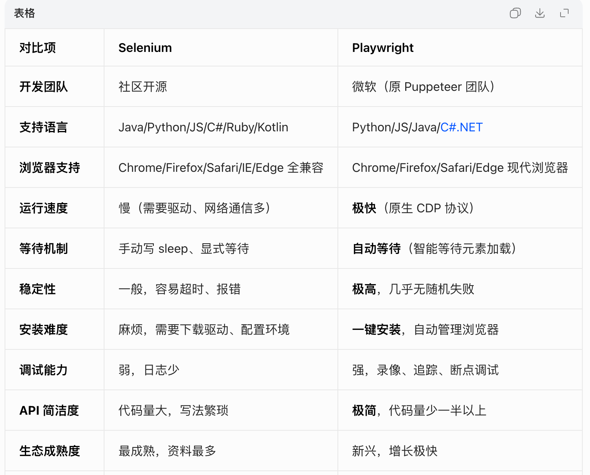
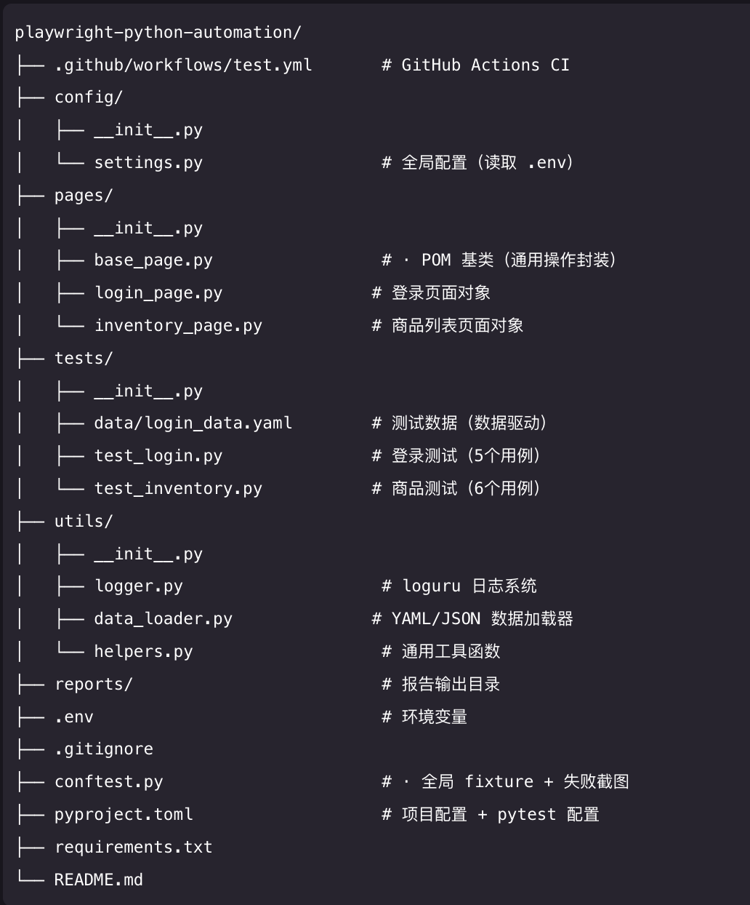

# 自动化测试框架改造与 UI 扩展开发计划

## 1. 项目背景

当前 `/Users/ninebot/Downloads/pythonProject` 已具备一套基础 API 自动化测试框架，能够完成基于 `pytest + requests + Allure + Excel` 的接口测试执行与报告输出，但整体更偏“开发自用脚本式框架”，存在以下问题：

- 配置与环境强耦合，存在硬编码的 `base_url`、`authorization`、`Allure` 路径和 `JAVA_HOME` 
- 目录结构偏粗糙，`conf / lib / testCase / testData` 分工不够清晰
- 测试用例承担了过多实现细节，包含数据解析、请求发送、断言、上下文传参、Allure 附件等逻辑
- 测试数据目前主要依赖 Excel，和执行逻辑耦合较深
- 当前框架仅覆盖 API，尚不具备 UI 自动化能力
- 代码有些过耦合，需要抽象处理
- python版本老，需要切换到3.12以上

结合后续测试目标，需要在保留已有可用能力的基础上，对当前项目进行优化重构，并新增 UI 自动化测试能力，形成一套可持续演进的自动化测试框架。

## 2. 建设目标

本次改造的总体目标如下：

- 在现有项目内完成自动化框架的平滑重构，而不是直接推倒重建
- 保留已有 API 自动化中的可复用能力
- 新增一套结构清晰的 `automation` 测试框架目录
- 建立统一的 `core / api / ui / tests` 分层结构
- 支持 `API + UI` 一体化自动化测试
- 支持多环境切换和基础权限测试分类
- 支持后续逐步迁移旧 API 用例，降低切换风险

## 3. 改造思路

本项目建议采用 `平滑重构` 方案，而不是在现有目录基础上继续堆功能。


基于两者的对比，选择playwright进行UI自动化实现

### 3.1 核心原则

1. 在现有项目中新增 `automation/` 目录，承载新框架
2. 旧 API 用例保留一段兼容期，不立即删除
3. 现有可复用工具逐步迁移到新结构中
4. 新增 Playwright UI 能力，与 API 共用底座能力
5. 优先完成 MVP，可运行、可汇报、可交付

### 3.2 目标目录结构



```text
pythonProject/
  automation/
    core/
      config/
      auth/
      data/
      assertions/
      fixtures/
      utils/
    api/
      client/
      modules/
      models/
    ui/
      pages/
      components/
      flows/
    tests/
      api/
      ui/
      smoke/
      regression/
      permission/
    testdata/
    pytest.ini
    main.py
    conftest.py
    requirements.txt
    README.md
```


## 4. 现有项目能力复用建议

### 4.1 建议保留并迁移的内容

- `lib/excel_reader.py`
  读取 Excel 的基础能力可以保留，迁移到新框架的 `core/data/loaders/`

- `lib/test_Data.py`
  缓存和多 Sheet 数据读取思路可以保留，但需要拆分为 `loader / provider / factory`

- `lib/context.py`
  用例间上下文传值能力可以保留，迁移到新框架公共层

- `lib/schema_validator.py`
  JSON 结构校验能力可以保留，迁移到断言层

### 4.2 建议重构或替换的内容

- `conf/url_configs.py`
  需改为多环境配置文件，不再硬编码 `base_url` 和 `authorization`

- `conf/base_configs.py`
  需移除强依赖 Windows 本地路径的配置方式

- `lib/my_requests.py`
  需重构为更清晰的 `BaseClient + 模块 API 封装`

- `main.py`
  不再作为核心运行入口，仅保留脚本辅助用途，执行方式统一回归 `pytest + 脚本`

- `testCase/` 下现有测试
  后续逐步迁移至 `automation/tests/`，按 API/UI/测试集分类重组

  
> 当前项目已有一套基础 API 自动化能力，但整体结构偏粗糙，不适合直接叠加 UI 自动化。建议采用平滑重构方案，在现有项目内新增一套 `automation` 新框架，逐步迁移已有 API 能力，并同步接入 Playwright UI 自动化。整体计划分 3 个阶段推进，每阶段 1 周，预计 3 周完成首版可交付 MVP。

## 5. 开发阶段计划

### 5.1 工作量评估口径

本次评估按 `1 人全职投入` 计算，默认每周 `5 个工作日`，每天按 `1 人天` 统计。

- 总周期：`3 周`
- 总工作量：`15 人天`
- 汇报口径：`每个阶段 1 周，每周都有可见输出`

说明：

- 本计划按 MVP 范围估算，不包含实时事件、复杂异步任务、大规模历史用例全部迁移
- 如果中途新增业务模块或临时插入环境联调问题，工期需要顺延
- 当前估算已包含框架设计、编码实现、基础自测、文档补充四类工作

### 5.2 旧项目用例规模与迁移口径

根据当前项目现状，旧项目 API 测试数据主要集中在 `testData/APIInfo.xlsx` 中，当前已识别到：

- `2 个业务 sheet`：`asserts`、`events`
- `asserts` sheet：`14 条`用例
- `events` sheet：`1 条`用例
- 旧项目当前可梳理的 API 数据驱动用例总量约 `15 条`

说明：

- 上一版文档中的数量是基于 xlsx 底层行结构的粗估，容易把空行或格式行一起算进去
- 本版以后统一以人工核对结果为准：`15 条 API 用例`

本次 3 周 MVP 改造不追求一次性迁移全部旧用例，采用“先梳理全量、先迁移核心、后逐步扩展”的方式推进：

- `第 1 周`：完成旧用例全量梳理，优先迁移并跑通 `10~15 条` API 用例到新框架
- `第 2 周`：新增 `8~12 条` 代表性 UI 用例，覆盖登录、资产、告警等主路径
- `第 3 周`：整理 `smoke / regression / permission` 测试集，确保首批迁移与新增用例可稳定执行

### 5.3 开发计划总表

| 阶段 | 具体改造步骤 | 主要工作内容 | 旧项目梳理/迁移范围 | 预计工作量 | 完成后达到的效果 |
|---|---|---|---|---|---|
| 第 1 周 | 旧项目结构与用例梳理 | 梳理 `conf/lib/testCase/testData` 现状，识别可复用能力、耦合点、旧用例分布 | 梳理 `2 个 sheet`、共 `15 条` API 用例 | `0.5 人天` | 明确哪些代码保留、哪些重构、哪些迁移 |
| 第 1 周 | 新框架骨架搭建 | 新建 `automation/` 目录，建立 `core/api/ui/tests/testdata` 结构，初始化 `pytest.ini`、`conftest.py`、`main.py`、`requirements.txt` | 不涉及用例迁移 | `0.5 人天` | 新框架具备承载能力，新旧框架可并行存在 |
| 第 1 周 | 配置与入口重构 | 拆分环境配置，替换硬编码 `base_url`、Allure 路径，统一 `main.py + pytest + scripts` 入口 | 不涉及用例迁移 | `0.5 人天` | 具备多环境切换基础，执行入口统一 |
| 第 1 周 | 登录 API 与认证能力实现 | 实现登录接口封装、登录响应解析、token 提取能力，形成新框架第一条核心 API 能力 | 为全部 `15 条` API 用例提供认证基础 | `1 人天` | 新框架具备统一登录能力，不再手工依赖固定 authorization |
| 第 1 周 | session/token 自动注入机制 | 将登录得到的 token 处理为 session 级参数，自动注入请求头，替代手工修改 `authorization` | 覆盖旧项目全部需要鉴权的 API 用例 | `1 人天` | 后续所有接口请求可自动带鉴权，不再手动改配置文件 |
| 第 1 周 | 首条 API 用例迁移与调通 | 选择 `asserts` 或 `events` 中 1 条代表性用例迁移到新框架，打通“登录 -> 取 token -> 自动鉴权 -> 业务请求 -> 断言 -> 报告”全链路 | 迁移并跑通 `1 条` 首条 API 用例 | `1 人天` | 新框架完成从 0 到 1 验证，证明结构和鉴权机制可用 |
| 第 1 周 | 数据访问层重构与批量迁移核心用例 | 将 Excel 读取与测试数据能力拆为 `loaders/providers/factories`，并在首条用例跑通基础上继续迁移其余核心 API 用例 | 在首条用例基础上继续迁移并跑通累计 `10~15 条` API 用例 | `1 人天` | 第 1 周即可展示可运行的新 API 框架 MVP，并具备批量迁移能力 |
| 第 2 周 | UI 运行环境接入 | 引入 Playwright，建立 `ui/pages/components/flows` 结构，验证浏览器可启动 | 不涉及旧用例迁移 | `1 人天` | 新框架从 API-only 扩展为 API + UI |
| 第 2 周 | 页面对象与组件封装 | 封装登录页、首页、资产页、告警页及表格、筛选器、菜单组件 | 不涉及旧用例迁移 | `2 人天` | UI 定位器和页面动作下沉，后续维护成本降低 |
| 第 2 周 | 业务流与首批 UI 用例落地 | 建立 `LoginFlow / AssetFlow / AlertFlow`，编写 UI 冒烟用例 | 新增 `8~12 条` 代表性 UI 用例 | `1.5 人天` | 可展示登录、资产、告警等常规 UI 自动化能力 |
| 第 2 周 | API/UI 共用能力打通与稳定性处理 | 打通配置、账号、数据、日志、报告等共用能力，修复首批 UI 稳定性问题 | 联调 `10~15 条` API 用例 + `8~12 条` UI 用例 | `0.5 人天` | 第 2 周结束后形成 API + UI 一体化可执行框架 |
| 第 3 周 | 测试集分类治理 | 按 `smoke / regression / permission` 分类重组用例，补充 marker 规范 | 纳入首批 `10~15 条` API 用例和 `8~12 条` UI 用例 | `1 人天` | 用例从散点执行变成按目标执行 |
| 第 3 周 | 基础权限测试建设 | 梳理管理员/分析员等基础角色，增加角色数据和页面可见性校验 | 新增 `4~6 条` 权限类用例 | `1 人天` | 框架具备基础权限校验能力 |
| 第 3 周 | 执行脚本与报告整理 | 建立 `smoke/regression` 执行脚本，统一 Allure 报告输出方式 | 覆盖首批已迁移/新增用例 | `1 人天` | 本地执行与报告查看方式标准化 |
| 第 3 周 | CI 接入与稳定性验证 | 增加基础 CI 入口，验证依赖、路径、执行链路 | 覆盖首批已迁移/新增用例 | `1 人天` | 新框架具备持续集成最小能力 |
| 第 3 周 | 文档整理与迁移收口 | 补充 README、编写规范、迁移说明，整理旧框架兼容期方案 | 输出迁移范围说明：已迁移 `10~15` API 用例，新增 `8~12` UI 用例，新增 `4~6` 权限用例 | `1 人天` | 形成可汇报、可交付、可推广的 MVP 版本 |

### 5.4 阶段一：API 框架重构与基础骨架搭建

**周期：第 1 周**  
**工作量：5 人天**

#### 阶段目标

完成新框架 `automation/` 的基础骨架建设，并将当前项目中的 API 关键能力从旧结构迁移到新结构，形成可运行的 API MVP。

#### 具体改造范围

本阶段重点处理以下内容：

- 新建 `automation/` 目录及基础分层结构
- 建立新的 `core / api / tests` 目录
- 建立新的 `pytest.ini`、`conftest.py`、`requirements.txt`、`README.md`
- 将 `conf/base_configs.py`、`conf/url_configs.py` 中的硬编码配置改造成多环境配置
- 优先实现登录 API，并完成 token 提取与 session 级自动鉴权
- 将 `lib/my_requests.py` 重构为 `BaseClient + 模块 API 封装`
- 先调通新框架下的第 1 条 API 用例，再扩展迁移剩余核心用例
- 将 `lib/excel_reader.py`、`lib/test_Data.py` 迁移为 `core/data/loaders + providers + factories`
- 将 `lib/schema_validator.py`、`lib/context.py` 迁移到公共层
- 迁移代表性的旧 API 用例到新结构中

#### 每日拆解

**Day 1：框架骨架搭建与目录初始化（1 人天）**

主要工作：

- 新建 `automation/` 目录
- 建立 `core / api / ui / tests / testdata` 基础目录
- 初始化 `pytest.ini`、`conftest.py`、`requirements.txt`、`README.md`
- 明确新框架入口文件 `automation/main.py`
- 保证新旧目录能够并行存在，不影响现有项目运行

完成后达到的效果：

- 新框架目录正式建立
- 项目具备后续迁移的承载空间
- 新旧框架可以并行，降低改造风险

**Day 2：配置层重构 + 登录 API 实现（1 人天）**

主要工作：

- 拆分环境配置，设计 `settings + env` 配置结构
- 将 `base_url`、Allure 配置从硬编码改为可配置模式
- 设计 `main.py + pytest + scripts` 的统一运行机制
- 去除对 Windows 本地路径的强依赖
- 在 `api` 层优先实现 `login_api`
- 解析登录响应，提取 token / session 信息

完成后达到的效果：

- 运行方式从“脚本硬编码执行”升级为“可配置执行”
- 多环境切换具备基础能力
- 项目后续接 CI 或在不同机器执行时成本显著降低
- 新框架具备第一个核心 API：登录能力

**Day 3：session/token 自动注入机制实现（1 人天）**

主要工作：

- 设计 session 级上下文或认证管理对象
- 将登录得到的 token 自动写入统一请求上下文
- 在 `BaseClient` 中自动注入 `authorization`
- 去掉原有“手工改 `url_configs.py` 中 authorization”的依赖方式

完成后达到的效果：

- 所有后续接口请求都可以复用登录态
- 认证方式从“人工改配置”升级为“自动登录后自动带 token”
- 新框架具备可持续扩展的鉴权能力

**Day 4：首条 API 用例迁移与调通（1 人天）**

主要工作：

- 从 `asserts` 或 `events` 中选择 `1 条` 最具代表性的用例
- 将该用例迁移到 `automation/tests/api`
- 打通“读取测试数据 -> 登录 -> 自动注入 token -> 调业务接口 -> 断言 -> Allure 报告”完整链路
- 修复新框架第一条真实用例暴露出的结构问题

完成后达到的效果：

- 新框架从 0 到 1 完成闭环验证
- 认证、请求、断言、报告链路得到首次实战验证
- 后续批量迁移有了标准模板

**Day 5：数据访问层重构 + 批量迁移核心 API 用例（1 人天）**

主要工作：

- 迁移现有 Excel 读取能力
- 建立 `loaders / providers / factories` 三层数据访问结构
- 将原先在用例中直接读取 Excel 的逻辑下沉到 `core/data`
- 在首条用例跑通基础上，继续迁移其余核心 API 用例
- 调整 Allure 输出、日志输出和 pytest 执行方式

完成后达到的效果：

- 第 1 周结束即可形成一版可运行的 API 新框架
- 新结构不再只是空目录，而是已经完成 `10~15 条` API 用例迁移与执行
- 可以作为第 2 周 UI 接入的稳定基础

#### 阶段输出

- `automation/` 框架骨架完成
- 配置、登录认证、session 鉴权、数据、断言、日志等公共层可用
- API 能力层成型，且已优先完成登录能力
- 首条 API 用例已完成闭环验证
- 代表性 API 用例累计迁移 `10~15 条` 并可执行

#### 阶段验收标准

- 新框架下 API 用例可执行并输出 Allure 报告
- 多环境配置结构已建立
- 登录 token 已能自动处理为 session 级鉴权信息
- 测试用例中不再直接承担大段请求拼装与 Excel 读取逻辑

### 5.5 阶段二：UI 自动化能力接入与代表场景落地

**周期：第 2 周**  
**工作量：5 人天**

#### 阶段目标

在新框架中完成 UI 自动化能力接入，并实现代表性业务场景落地，形成 API + UI 共存的自动化结构。

#### 具体改造范围

- 在 `automation/` 中新增 `ui/` 目录
- 引入 Playwright 依赖和执行配置
- 建立 `pages / components / flows` 三层 UI 结构
- 封装登录、仪表盘、资产、告警等基础页面对象
- 建立基础 UI 测试用例
- 打通 UI 与 `core` 公共配置、账号、测试数据能力

#### 每日拆解

**Day 1：UI 运行环境接入（1 人天）**

主要工作：

- 安装并接入 Playwright
- 调整 `requirements.txt` 和 UI 相关启动配置
- 建立 `ui/pages`、`ui/components`、`ui/flows` 目录结构
- 验证 Playwright 能在当前项目中启动并执行基础页面打开能力

完成后达到的效果：

- 项目具备 UI 自动化运行基础
- 新框架正式从 API-only 扩展为 API + UI 双能力框架

**Day 2：页面对象基础封装（1 人天）**

主要工作：

- 封装 `LoginPage`
- 封装 `DashboardPage`
- 梳理页面公共操作方式
- 统一页面基础方法和基础等待逻辑

完成后达到的效果：

- 登录页与首页具备可复用的页面对象封装
- 后续 UI 编写不再从裸 `page.click()` 开始堆积

**Day 3：组件对象与典型页面扩展（1 人天）**

主要工作：

- 抽取表格、筛选器、菜单等通用组件
- 封装 `AssetPage`、`AlertPage` 等典型业务页面
- 建立组件与页面对象的依赖关系

完成后达到的效果：

- UI 层从单页封装升级为“组件 + 页面”组合模式
- 后续新增页面时能明显减少重复工作量

**Day 4：业务流与 UI 用例落地（1 人天）**

主要工作：

- 封装 `LoginFlow`、`AssetFlow`、`AlertFlow`
- 编写首批 UI 冒烟用例
- 将业务步骤从测试文件中进一步抽离到 flow 层

完成后达到的效果：

- 测试文件更接近业务语言
- UI 用例具备基础可维护性，不会全部堆在单个测试文件里

**Day 5：API 与 UI 公共能力打通及稳定性验证（1 人天）**

主要工作：

- 打通 UI 与配置、账号、数据层的共用关系
- 验证 API 与 UI 在一个框架中的并行执行能力
- 处理首批 UI 运行中的基础稳定性问题

完成后达到的效果：

- 新框架已不只是“新增 UI 目录”，而是 API/UI 真正共用一套底座
- 第 2 周结束时可展示 API + UI 一体化测试能力

#### 阶段输出

- Playwright UI 自动化能力接入完成
- 页面对象、组件对象、业务流结构成型
- 首批 UI 用例可执行
- API 与 UI 共用配置、账号、数据底座

#### 阶段验收标准

- 登录和至少 1~2 个代表页面的 UI 用例可稳定执行
- 页面定位器和页面操作已下沉到 `ui` 层
- UI 测试文件可保持轻量编排风格

### 5.6 阶段三：测试集治理、权限分类与交付落地

**周期：第 3 周**  
**工作量：5 人天**

#### 阶段目标

将前两周形成的能力整理成一版可交付的 MVP，补齐测试集分层、基础权限校验、执行入口和文档说明。

#### 具体改造范围

- 按 `smoke / regression / permission` 重组测试集
- 增加基础权限测试分类
- 建立统一执行脚本和入口说明
- 接入 CI 执行入口
- 完善 README 和迁移说明
- 评估旧框架兼容期及后续下线路径

#### 每日拆解

**Day 1：测试集分类整理（1 人天）**

主要工作：

- 将已有 API/UI 用例按 `smoke / regression / permission` 分类
- 补充 pytest marker 规范
- 梳理各类测试集的执行边界

完成后达到的效果：

- 用例从“散点执行”变成“按目标执行”
- 团队能区分哪些用于冒烟、哪些用于回归、哪些用于权限验证

**Day 2：基础权限测试能力建设（1 人天）**

主要工作：

- 梳理管理员、分析员等基础角色
- 增加角色级测试数据
- 增加页面可见性与基础动作权限用例

完成后达到的效果：

- 框架具备最基础的权限测试能力
- 后续角色扩展有统一入口，不会再散落在功能用例中

**Day 3：执行脚本与报告能力整理（1 人天）**

主要工作：

- 建立统一执行脚本，如 `smoke`、`regression` 执行脚本
- 整理 Allure 结果目录与报告生成方式
- 统一 `main.py`、pytest、脚本三者的职责边界

完成后达到的效果：

- 执行入口清晰
- 报告输出方式统一
- 本地运行更适合测试团队日常使用

**Day 4：CI 接入与稳定性验证（1 人天）**

主要工作：

- 增加基础 CI 入口配置
- 验证框架在持续集成场景下的最小可运行能力
- 修正因路径、配置、依赖带来的执行问题

完成后达到的效果：

- 新框架具备自动化执行基础
- 不再局限于开发本机本地运行

**Day 5：文档整理与迁移收口（1 人天）**

主要工作：

- 补充框架说明文档
- 增加用例编写规范和目录使用说明
- 梳理旧用例迁移策略和旧框架兼容期方案
- 形成最终汇报与交付版本

完成后达到的效果：

- 框架具备团队交接能力
- 不再依赖单人经验口头维护
- 第 3 周结束后可形成一版完整 MVP 对外汇报成果

#### 阶段输出

- `smoke / regression / permission` 分类执行能力
- 基础权限测试能力
- 本地执行脚本与报告输出能力
- CI 接入入口
- 文档与迁移说明

#### 阶段验收标准

- 三类测试集可分别执行
- Allure 报告输出稳定
- README、执行方式、迁移说明完整
- 框架已具备团队使用和持续扩展基础


## 6. 主要风险与控制措施

### 风险一：旧框架和新框架并存期间维护成本上升

**控制措施：**

- 明确兼容期范围
- 先迁移代表性模块
- 避免双边长期并行开发

### 风险二：UI 自动化接入后框架复杂度明显上升

**控制措施：**

- UI 部分严格采用 `pages / components / flows` 分层
- 测试层不直接写定位器和细节逻辑

### 风险三：测试数据管理继续与执行逻辑耦合

**控制措施：**

- 将数据访问统一下沉到 `core/data`
- 测试用例不直接读取 Excel

### 风险四：开发周期内功能范围扩张

**控制措施：**

- 先做 MVP
- 只覆盖代表性 API/UI 模块
- 实时事件、异步任务等能力后续扩展

## 7. 最终交付物

本次开发计划完成后，预期交付如下：

- 一套新的 `automation/` 自动化测试框架
- 支持 API 与 UI 共存的测试结构
- 可复用的公共配置、数据、断言、fixtures 能力
- 首批代表性 API 用例
- 首批代表性 UI 用例 以 Page Object Model 模式
- 可运行的 `smoke / regression / permission` 测试集
- Allure 报告能力
- 基础 CI 集成能力
- 框架使用说明与迁移说明

## 8. 结论

综合当前项目现状与后续扩展目标，建议本项目采用 `平滑重构 + UI 能力接入` 的方案推进，而不是在现有结构基础上继续叠加功能。

该方案的优势在于：

- 能最大化复用现有 API 能力
- 能降低一次性推翻重建的风险
- 能较自然地接入 UI 自动化
- 能在 3 周内形成一版可交付的 MVP

按本开发计划推进实施，并在第 1 周结束后进行一次阶段评审，确认 API 重构骨架与目录结构稳定，再继续进入 UI 和交付阶段。
